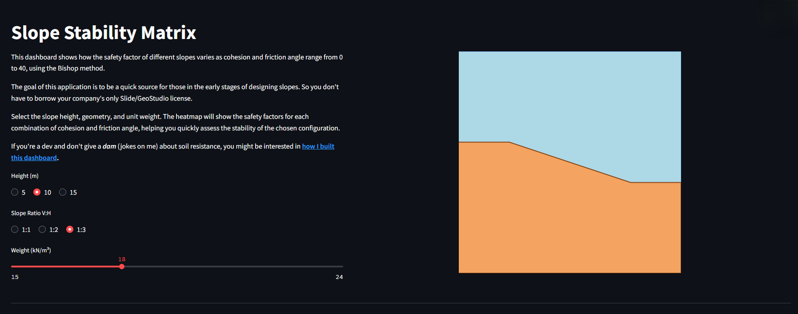
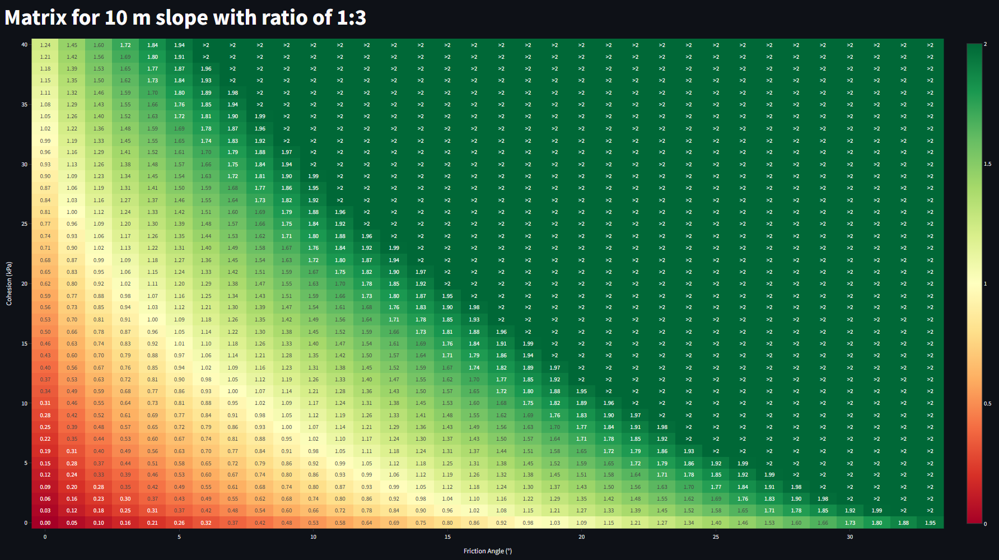

# Slope Stability Dashboard

This Streamlit-based application allows quick evaluation of slope stability by returning the safety factors based on user inputs. The app provides an interactive heatmap showing how the safety factor varies with cohesion and friction angle for different slope configurations.



## Project Structure

The project is organized as follows:

```plaintext
slope-variance-study/
├── assets/             # Folder to store any images or visual assets for the dashboard.
├── dashboard.py        # Main Streamlit app file that runs the dashboard.
├── database.py         # Defines database models, structure and CRUD operations.
├── database.db         # SQLite database file where the analysis results are stored.
├── LICENSE             # MIT LICENSE for the project
├── main.py             # Code to compute and save analysis results into the database.
├── README.md           # Project documentation.
├── requirements.txt    # List of dependencies for the project.
```

## Tech Stack

This project was built using the following technologies and tools:

- **Streamlit**: A framework for building interactive web apps for data science and machine learning.
- **Python 3.13**: The main programming language used for development.
- **Pandas**: A library for data manipulation and analysis.
- **NumPy**: A library for numerical computing.
- **Plotly**: Libraries for data visualization (graphs and heatmaps).
- **SQLite3**: Used for storing the results of stability analysis.

## Features
- Select slope height (5m, 10m, or 15m).
- Choose geometry ratio (1:1, 1:2, or 1:3).
- Input unit weight between 15 to 24 kN/m³.
- Calculate and visualize the safety factor using a 1600-point heatmap.
- View the impact of cohesion (0-40 kPa) and friction angle (0-40°) on the slope stability.

## Motivation
This application is designed to speed up the preliminary design process of slopes. Instead of relying on expensive software licenses for stability analysis, engineers can quickly assess the stability of a slope configuration directly in their browser. You can get an estimate of your final project before running any analysis, saving time for the engineer and freeing up the software license for a co-worker.

## Installation

To run this app locally, [create a virtual environment](https://docs.python.org/3/library/venv.html) and follow these steps:


1. Clone the repository:
   ```bash
   git clone https://github.com/marcuszucareli/slope-variance-study.git

2. Install the dependencies
   ```bash
   pip install -r requirements.txt

3. Run the dashboard.py with streamlit
   ```bash
   streamlit run dashboard.py

## Usage

- Open the dashboard in your browser.
- Select the desired slope dimensions and unit weight.
- The heatmap will display the safety factor for different combinations of cohesion and friction angle.

## Example

Here’s a sample of the inputs fields


Here's the corresponding heatmap showing the safety factor for a slope with a height of 10m, a 1:3 geometry ratio, and a unit weight of 18 kN/m³. The color gradient represents the variation in safety factor with respect to cohesion and friction angle.



## Contributing
Contributions are welcome! Feel free to fork this repository and submit pull requests.

### *To-do*:
- Run the stability analysis with watertable set to the top of the slope.
    - Add a watertable column in the database and fill previous values with zero.
    - Modify main.py to incorporate watertable into the calculations.
    - Run the analysis.
- Create a REST API to make the data available to other projects.
- Add another page to this dashboard with a study on how the safety factor is influenced by each parameter
- Develop a Machine Learning model to predict the safety factor of a slope.
- Modify the author section to contributors and add yourself there!.

## License
This project is licensed under the MIT License - see the [LICENSE](https://github.com/marcuszucareli/slope-variance-study?tab=MIT-1-ov-file#) file for details.